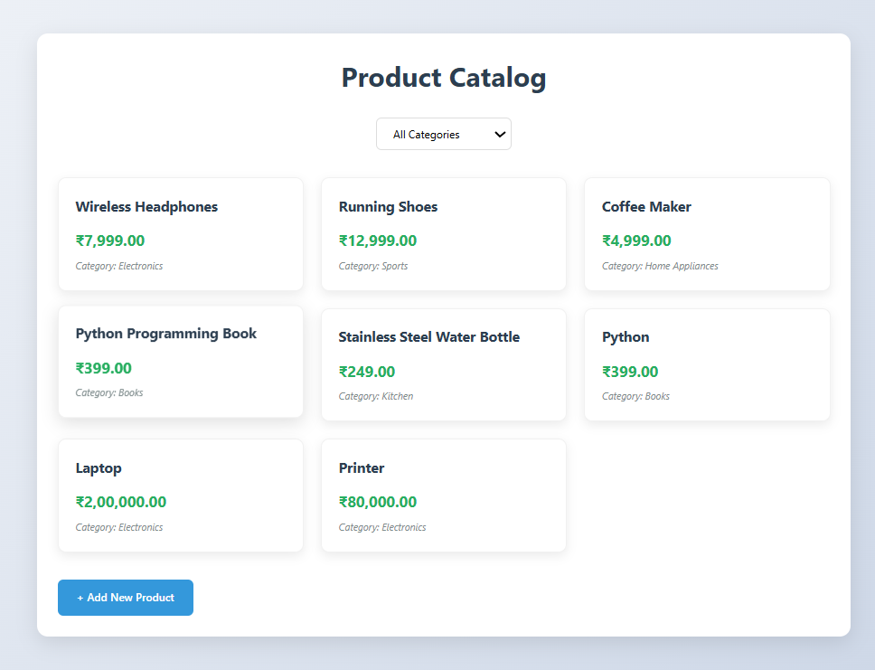
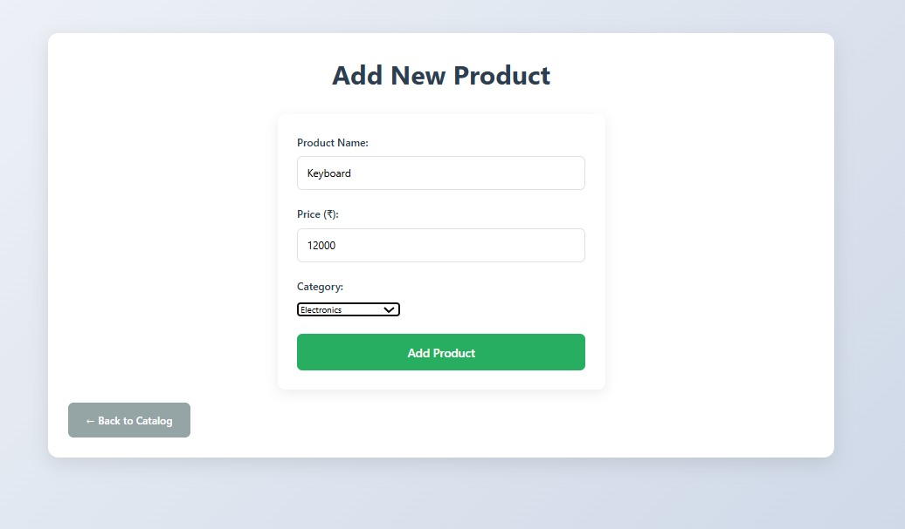
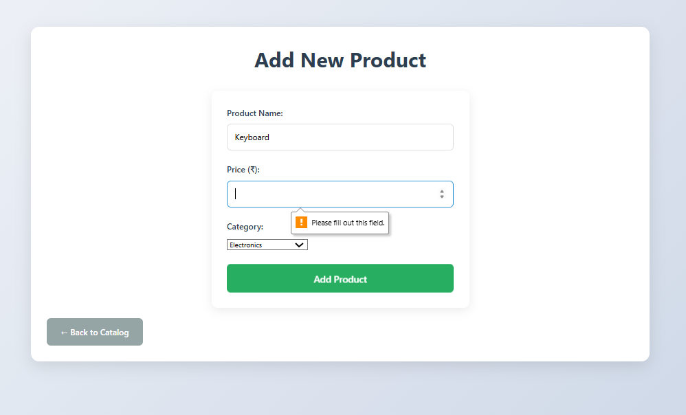
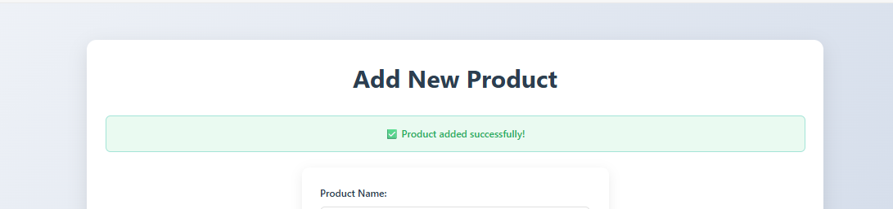
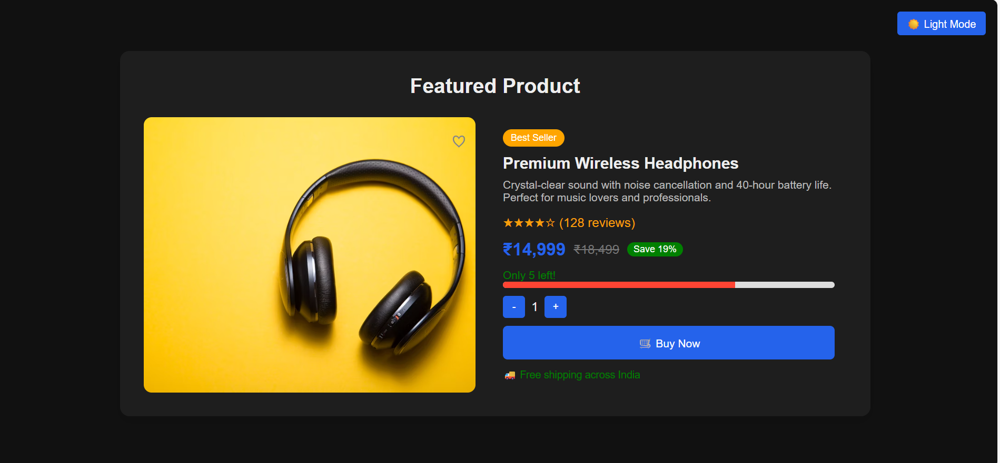

---
# 🌐 Web Development Internship Assignment – Adhyatmik

A web-based project submission for the **Adhyatmik Web Development Internship**.  
This project demonstrates a PHP/MySQL **Product Catalog** (Backend) and a **Featured Product Section** (Frontend) using HTML/CSS/JS.

---

## 🔧 Tech Stack
- **Frontend:** HTML, CSS, JavaScript  
- **Backend:** PHP  
- **Database:** MySQL  

---

## 🚀 Features

### ✅ Task 1 – Product Catalog (Backend)
- MySQL `products` table with fields: `id`, `name`, `price`, `category`, `created_at`
- Display product list in a clean grid layout
- Add new product via form with validation
- Category filter dropdown
- Prices formatted in **₹ INR**
- Secure database queries using **prepared statements**

### ✅ Task 2 – Featured Product Section (Frontend)
- Product card with image, name, description, rating, price, stock, quantity selector, and **Buy Now** button
- Light & Dark mode toggle
- Heart icon for favorites
- Quantity increment/decrement buttons
- Modal simulation for **Buy Now**
- Fully responsive design

---

## 📂 Project Structure
```

product-catalog-system/
├── Task1
│   ├── add\_product.php
│   ├── database.php
│   ├── db.sql
│   ├── functions.php
│   ├── index.php
│   └── style.css
├── Task2
│   ├── featured-product.html
│   └── featured-product.css
├── Screenshots
│   ├── Product\_Catalog.png
│   ├── New\_Product.png
│   ├── Validation.png
│   ├── Product\_Added.png
│   ├── light\_mode.png
│   └── dark\_mode.png
└── README.md

```

---

## 📸 Demo Screenshots

### Task 1 – Product Catalog
**Product List**  


**Add Product Form**  


**Form Validation**  


**Product Added Successfully**  


---

### Task 2 – Featured Product Section
**Light Mode**  


**Dark Mode**  


---

## ✍️ Developer
**Deepa Umesh Savita**  
🎓 Final Year B.Sc. Computer Science  
💻 Passionate about Web Development

[](https://github.com/deepasavita)  
[](https://www.linkedin.com/in/deepa-savita)
```

---


